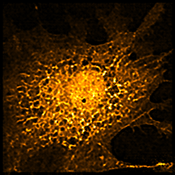

# Super-resolution CNN based on DenseED blocks
This repository includes the code used for the geenration of super-resolution of microscopy images training using the small data (a small training dataset and really useful for biomedical applications like X-ray, MRI and in vivo imaging). 

Datasets: 
1. W2S dataset (open-source dataset)
2. BPAE dataset (custom-built two-photon microscopy)

Diffraction-limited image: (BPAE sample from test dataset: FOV8)

Target super-resolution image geenrated with SRRF method: 

Fully convolutional networks (FCNs) without DenseED blocks:

Fully convolutional networks (FCNs) with DenseED blocks:

Generative adviseral networks (GANs) without DenseED blocks:

Generative adviseral networks (GANs) with DenseED blocks:

Transfer learning: 
Mouse Kideny input: diffraction-limited image (FOV1)

Estiamted super-resolution image using FCN with DenseED blocks:

Target super-resolution image (generated using SRRF method): 

## **Copyright**

© 2022 Varun Mannam, University of Notre Dame  

## **License**

Licensed under the [GPL](https://github.com/ND-HowardGroup/Deep_learning_Super-resolution/blob/main/LICENSE)
