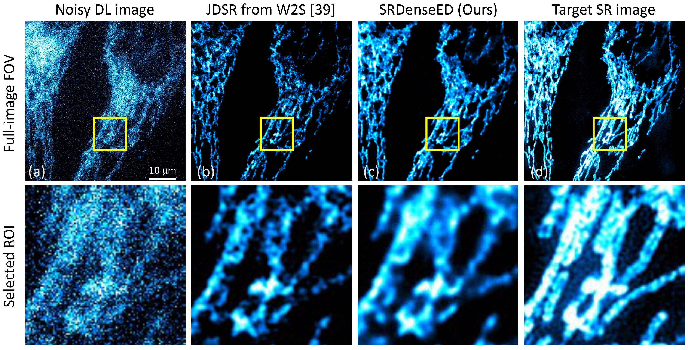

# Application-Specific Super-resolution CNN based on DenseED blocks
This repository includes the code used for the geenration of super-resolution of microscopy images training using the small data (a small training dataset and really useful for biomedical applications like X-ray, MRI and in vivo imaging). 

# Motivation: 
Figure shows the tradeoff between dataset size and performance: 
1. Show the requirement of the SR datasets

2. Show the illustration of the ML model (tradeoff between training dataset size and performance metrics)

3.Tradeoff of ML methods performance metrics vs training dataset size

# Datasets: 
1. W2S dataset (open-source dataset)
2. BPAE dataset (custom-built two-photon microscopy)

# Sample dataset images: 
1. W2S dataset samples (experimentally captured diffraction-limited (using widefield microscopy setup) and super-resolution images (SIM microscope setup))

2. BPAE dataset samples (experimentally captured diffraction-limited (using two-photon microscopy setup) and super-resolution images (computationally generated using SRRF method))

# Results
# W2S dataset
Widefield2SIM dataset (comination of experimental diffraction-limited images and SIM images as target images of human cells)
Part (a):
1. Effect of DenseED blocks on noise-free W2S dataset when comapred to simple FCNs

2. Illustration of training size vs accuracy in DenseED method on noise-free W2S dataset

3. Qualitative results of noise-free W2S sample when ML model trained with only 15 FOVs

Part (b):
4. Effect of DenseED blocks on noisy W2S dataset when comapred to simple FCNs

5. Illustration of training size vs accuracy in DenseED method on noisy W2S dataset

6. Qualitative results of noisy W2S sample when ML model trained with only 15 FOVs

# BPAE dataset
Sample: BPAE, captured using custom-built two-photon microscopy (BPAE sample from test dataset: FOV8)
Resiolution improvemnt using SRdenseED method (by a factor of 2x)

# Ablation study of the trained ML model (using BPAE dataset only)
1. MSE loss of different denseED configurations (varied number of layers in each denseED block by keeping same number of dense blocks for the whole experiment)

2. Appendix using different hyper-paramaeters (includes different losses, activation, learning rate, combination of losses, training dataset size..etc)

3. Performance of GANs using DenseED blocks on the BPAE sample dataset

4. GANs illustration

5. GANS result on the BPAE dataset

6. Gneralization of trained model (trained on BPAE dataset with SRdenseED model (3,6,3)): 
Sample: Mouse Kidney, captured using custom-built two-photon microscopy

Diffraction-limited Image  | SRDenseED result         | Target SR Image (using SRRF method) |	
:-------------------------:|:-------------------------:|:-------------------------:|
   |  |  |

## **Copyright**

© 2022 Varun Mannam, University of Notre Dame  

## **License**

Licensed under the [GPL](https://github.com/ND-HowardGroup/Deep_learning_Super-resolution/blob/main/LICENSE)
